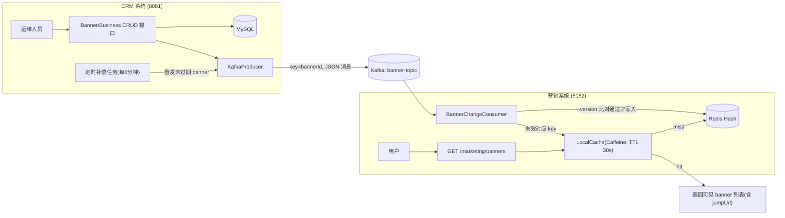

# Banner 双系统设计方案（CRM + 营销系统）

## 架构总览



## 数据模型（MySQL）

**business_info（业务表）**：id、biz_code（业务编码，用于缓存 key，如 agri/digital/clothes/beauty）、biz_name（助农产品/手机数码/服装/化妆品）、description、status、create_time、update_time

**banner_info（banner 表）**：id、biz_id（对应业务 id）、title、image_url（宣传图）、jump_url（跳转 URL：直播间/活动页/商品详情）、start_time、end_time、sort、version（取 update_time，用于乱序比较）、create_time、update_time

## 模块划分

```
BannerProject4Java
├── banner-common      共享实体 / 消息体 / 枚举 / 常量
├── banner-crm         CRM 系统 :8081
└── banner-marketing   营销系统 :8082
```

**banner-common**
- `BusinessInfo` / `BannerInfo` 实体（Lombok @Data，字段对应表）
- `OperateType` 枚举（CREATE / UPDATE / DELETE）
- `BannerMessage`（Kafka 消息体）：operateType + banner 全量字段 + version + messageId（幂等 TODO 预留）
- `BannerConstants`：topic 名 `banner-topic`、Redis key 前缀

**banner-crm**
- `BannerMapper` / `BusinessMapper`（MyBatis-Plus BaseMapper，免写 SQL）
- `BannerController` / `BusinessController`：增删改查 REST 接口
- `BannerService`：事务内写 MySQL，提交后发 Kafka（key = bannerId 保证分区内有序）
- `BannerProducer`：KafkaTemplate + Jackson JSON 序列化
- `BannerCompensateTask`：@Scheduled 每 5 分钟扫描未过期 banner 全量重发 → 解决消息丢失

**banner-marketing**
- `BannerChangeConsumer`：@KafkaListener 消费消息；version 比对通过才写 Redis；DELETE 写墓碑记录；消息幂等处标 TODO
- `LocalCache`：Caffeine，key = bizCode+日期，TTL 30s，支持手动失效
- `BannerCacheService`：localCache → Redis HGETALL → 过滤 now∈[start,end] 且未删除 → 按 sort 排序 → 回填 localCache
- `BannerQueryController`：GET /marketing/banners?bizCode=xxx
- `BannerVO`：id、title、imageUrl、jumpUrl、sort（用户点击后由前端用 jumpUrl 跳转）

## 关键设计决策（对应需求 6 点）

1. **Redis KV 设计**：key = `banner:{bizCode}:{yyyyMMdd}`（如 `banner:agri:20260910`）；value = Redis Hash（天然即 Map 集合），field = bannerId，value = banner JSON；跨天 banner 写入每一天的 key；key TTL 到当天 24 点
2. **查询链路**：LocalCache → Redis → 时间过滤+排序 → 回填；营销系统不读 MySQL，Redis miss 返回空列表，由补偿任务保证最终有数据
3. **消息丢失**：CRM 定时任务全量重发未过期 banner，消费端按 version 幂等覆盖
4. **insert/update 乱序**：三层防护——Kafka key=bannerId 分区有序 + version 比对（旧消息丢弃）+ 定时对账自愈；DELETE 用墓碑防止迟到消息复活已删数据

消费端核心逻辑示意：

```java
// BannerChangeConsumer（核心思路示意）
long stored = readStoredVersion(msg);      // 读取缓存中已存的版本
if (msg.getVersion() <= stored) {
    return;                                // 迟到的旧消息（如后到的 insert）直接丢弃
}
for (LocalDate day : coveredDays(msg)) {   // banner 跨几天就写几个 key
    redis.opsForHash().put(dayKey(day), msg.getBannerId(), toJson(msg));
}
// TODO 消息幂等：基于 messageId 去重（后续用 Redis SETNX 实现）
```

5. **消息幂等**：预留 messageId 字段，消费端标 TODO
6. **简洁性**：不做登录/商品/订单等业务、不做前端；MyBatis-Plus 免写 SQL；共享模型收敛到 banner-common

## 接口清单

CRM（运维，8081）：
- `POST /crm/banner`、`PUT /crm/banner`、`DELETE /crm/banner/{id}`、`GET /crm/banner/list`
- `POST /crm/business`、`GET /crm/business/list`

营销（用户侧，8082）：
- `GET /marketing/banners?bizCode=agri` → 当前可见 banner 列表（含 jumpUrl）

## 配套设施

- `docker-compose.yml`：MySQL 8 + Redis 7 + Kafka（KRaft 单节点免 ZooKeeper；本机已有中间件可跳过）
- `banner-crm/src/main/resources/db/schema.sql`：建表 + 示例数据（4 个业务线 + 覆盖不同时间段的 banner）
- `README.md`：模块说明与启动顺序（中间件 → CRM → 营销）